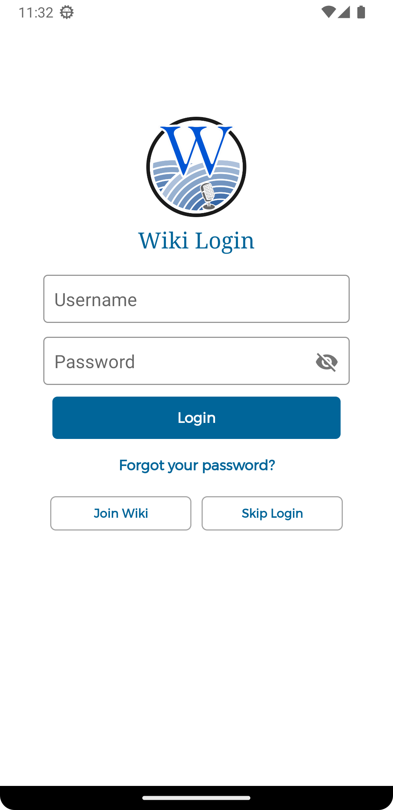
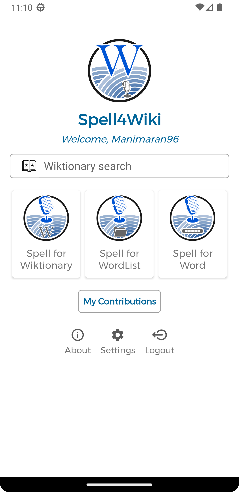
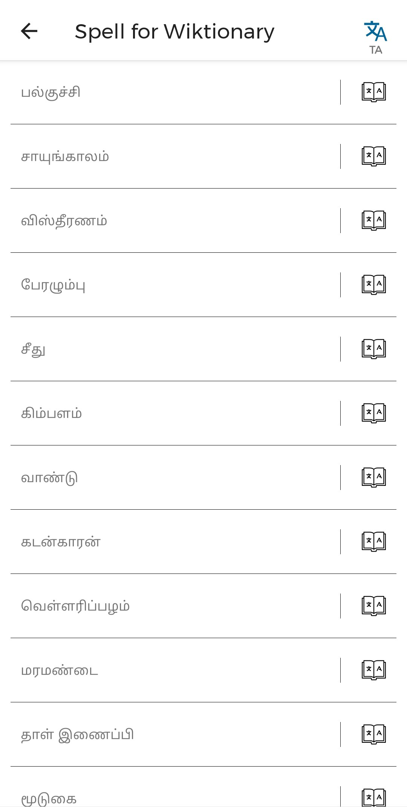
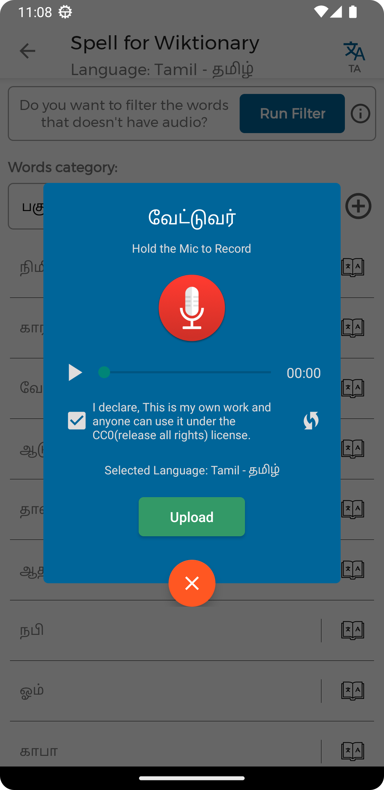
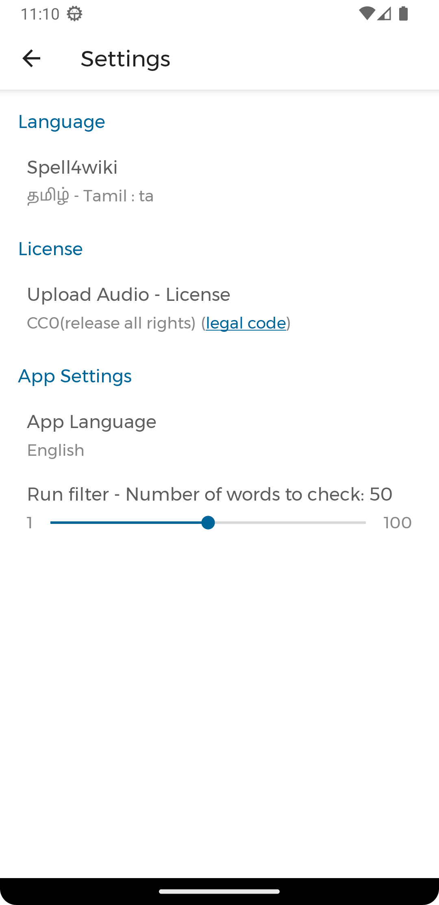
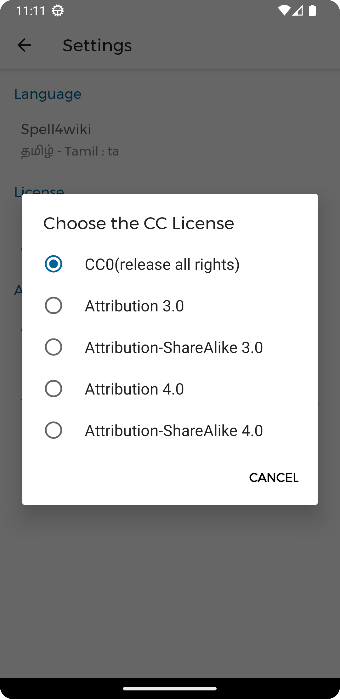
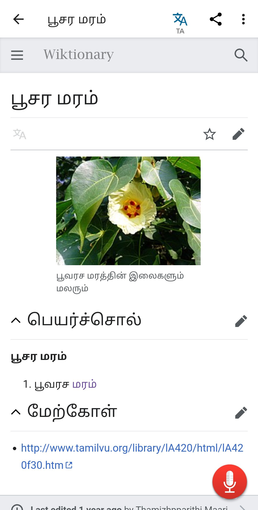
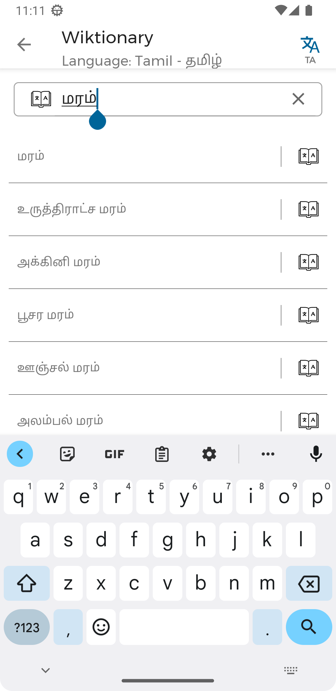

<h1 align="center">
Spell4Wiki - Spell For Wiktionary/Wikimedia Commons
</h1>

Spell4Wiki is a mobile application to record and upload audio for Wiktionary words to Wikimedia Commons. 
Spell4Wiki also a multilingual Wiki-Dictionary.

   
   

## Features

### Core Features
- 📋 **Spell4Wiki**: Record and upload audio for Wiktionary category-based word lists
- 📄 **Spell4WordList**: Upload audio for custom word lists from text files or copy-paste
- 🎤 **Spell4Word**: Record and upload pronunciation for individual words
- 🔍 **Wiktionary Search**: Search word meanings from Wiktionary in multiple languages

### Technical Features
- 🌍 **250+ Language Support**: Record audio for words in 250+ languages
- 🎵 **Audio Processing**: High-quality WAV recording with OGG conversion
- 🔍 **Smart Filtering**: Check which words already have audio to avoid duplicates
- ⚡ **Batch Processing**: Handle multiple words efficiently
- 📤 **Wikimedia Integration**: Direct upload to Wikimedia Commons with proper categorization

### Purpose of this app
There are plenty of words in the Wiktionary. But they do not have enough pronunciation audio files. So we can upload pronunciation audio for words in a simple way. And we can use those pronunciation for wiki data planning and other technologies like machine learning under CC-license. And other linguists can learn how to pronounce a word.

## 📱 Screenshots

<kbd align="center">

</kbd>

## 🏆 What Spell4Wiki App Achieved?
- 🌍 **250+ Languages Supported** across all 4 features
- 🎙️ **40,000+ Audio Files** uploaded to Wikimedia Commons from contributors worldwide
- 📂 **Organized Contributions** - All audio files categorized under [Wikimedia Commons](https://commons.wikimedia.org/wiki/Category:Files_uploaded_by_spell4wiki)
- 👥 **Global Community** of language enthusiasts and contributors
- 🆓 **Free & Open Source** contribution to world's knowledge base

## 🔗 Useful Links

### Official Resources
- 📋 **[Commons:Spell4Wiki](https://commons.wikimedia.org/wiki/Commons:Spell4Wiki)** - Official Wikimedia Commons page
- 📁 **[Files uploaded by Spell4Wiki](https://commons.wikimedia.org/wiki/Category:Files_uploaded_by_spell4wiki)** - Browse all contributions
- 📝 **[Developer Blog](https://manimaran96.wordpress.com/category/android-apps/spell4wiki/)** - Development updates and insights
- 📊 **[Privacy Policy](https://github.com/manimaran96/Spell4Wiki/blob/master/docs/PRIVACY_POLICY.md)** - Data handling information

## 🚀 How to Use

1. 📝 **Create Account**: Create account in [Wikimedia Commons](https://commons.wikimedia.org) and login (if no account)
2. 🌍 **Select Language**: Choose from 250+ supported languages
3. 🎙️ **Choose Recording Mode**: Spell4Wiki, Spell4WordList, or Spell4Word
4. 🎵 **Record & Upload**: Record pronunciation and upload to Wikimedia Commons

### 📺 Tutorial Videos

| Language | Video Link | Creator |
| :------- | :---------: | :------------- |
| English | [Introduction](https://youtu.be/IMku3FL7s3I) • [Tutorial](https://youtu.be/Fu4kQcv04kA) | [Ganesh](https://commons.wikimedia.org/wiki/User:Libreaim) |
| Tamil | [Tutorial](https://youtu.be/4y5I1sUW1ys) | [Manimaran](https://commons.wikimedia.org/wiki/User:Manimaran96) |

More tutorial videos in different languages are available in our [Contributing Guide](https://github.com/manimaran96/Spell4Wiki/blob/master/docs/CONTRIBUTING.md#how-to-use-spell4wiki).

## 🤝 Contributing

We welcome contributions from developers, linguists, translators, and language enthusiasts! Whether you want to add new features, fix bugs, improve documentation, or add support for new languages, your help is valuable.

### Ways to Contribute
- **Code Contributions**: Bug fixes, new features, performance improvements
- **Language Support**: Add new languages or improve existing language data
- **Audio Contributions**: Record pronunciations for words in your native language
- **Documentation**: Improve guides, tutorials, and documentation
- **Testing**: Report bugs and test new features
- **Translations**: Help translate the app interface

### Getting Started with Development
1. Fork the repository
2. Clone your fork: `git clone https://github.com/yourusername/Spell4Wiki.git`
3. Create a feature branch: `git checkout -b feature/your-feature-name`
4. Make your changes and commit: `git commit -m "Add your feature"`
5. Push to your fork: `git push origin feature/your-feature-name`
6. Create a Pull Request

For detailed contribution guidelines, see our [Contributing Guide](https://github.com/manimaran96/Spell4Wiki/blob/master/docs/CONTRIBUTING.md).

## ☕ Ways to Support

Your support helps maintain and improve Spell4Wiki, enabling us to add new features and support more languages.

### Buy us a Coffee

#### Donate via PayPal
Support development through PayPal for international contributors:

**PayPal Link:** [Dontate via PayPal](https://www.paypal.me/manimaranlpt)

#### UPI Payment (India)
For contributors in India, you can support via UPI:

**UPI ID:** `spell4wiki@ybl`

**UPI Link:** [Dontate via UPI](upi://pay?pa=spell4wiki@ybl&pn=Manimaran&tn=&am=)

**UPI QR Code:**

*Share the donation details to `manimarankumar96@gmail.com`

For more donation details, visit our [Donation Guide](https://github.com/manimaran96/Spell4Wiki/blob/master/docs/DONATION.md).

## 🙏 Acknowledgments

### 🚀 Initiated & Powered By
- 🏛️ **[Kaniyam Foundation](http://www.kaniyam.com/)** - Original project concept and ongoing support
- 🐧 **[VGLUG](https://vglug.org/)** - Villupuram GNU Linux Users Group
- 🌐 **[Tamil Wiki Community](https://en.wikipedia.org/wiki/Tamil_Wikipedia)** - Community support and guidance

### 💡 Inspired By
- 🎵 **[WikiAudio](https://github.com/Atul22/wikiAudio)** - Initial inspiration for audio contribution tools

### 👥 Key Contributors
Special thanks to our contributors who have provided technical expertise, Wikimedia knowledge, and ongoing support:

- **[Irmodesgh](https://github.com/lrmodesgh)** - Technical contributions
- **[Shrinivasan](https://github.com/tshrinivasan)** - Wikimedia expertise
- **[Khaleel Jageer](https://github.com/jskcse4)** - Development support
- **[Info farmer](https://www.mediawiki.org/wiki/User:Info-farmer)** - Wikimedia guidance
- **[Ragulkanth](https://github.com/ragulkanth)** - Technical contributions
- **[Sivaraam](https://github.com/sivaraam)** - Code review and improvements

View all contributors on our [Contributors Page](https://github.com/manimaran96/Spell4Wiki/graphs/contributors).

### 💬 Community Links
- **[Telegram Group](https://t.me/spell4wiki)** - Join our community discussions
- **[GitHub Issues](https://github.com/manimaran96/Spell4Wiki/issues)** - Report bugs and request features
- **Email**: [manimarankumar96@gmail.com](mailto:manimarankumar96@gmail.com) - Direct contact with the developer
- **Telegram**: [@manimarank](https://t.me/manimaran_k) - Developer contact

## 📸 Application Screenshots

| Login | Main Dashboard | Word Lists | Record & Upload |
|:-:|:-:|:-:|:-:|
|  |  |  |  |

| Settings | License Info | Word Details | Wiktionary Search |
|:-:|:-:|:-:|:-:|
|  |  |  |  |

## 📊 Contribution Statistics

## 📄 License

Spell4Wiki is Free and Open Source Software (FOSS). You can use, study, share, and improve it freely.

This project is licensed under the [GNU General Public License v3.0](https://www.gnu.org/licenses/gpl.html). You can redistribute and/or modify it under the terms of the GPL as published by the Free Software Foundation, either version 3 of the License, or (at your option) any later version.

### What this means:
- ✅ **Freedom to use** the software for any purpose
- ✅ **Freedom to study** how the program works and change it
- ✅ **Freedom to redistribute** copies to help others
- ✅ **Freedom to distribute** copies of your modified versions

---

<strong>Made with ❤️ by the open source community and Wikimedia community</strong> 
<em>Preserving languages, one pronunciation at a time</em>

